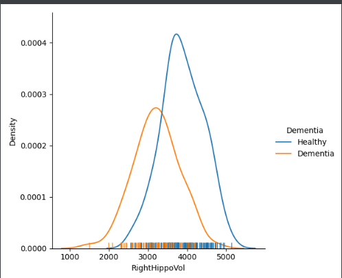
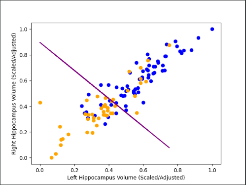
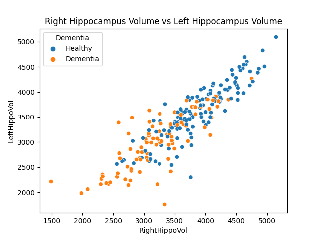

# CogniCast

This project was inspired by some of the machine learning techniques that I learned in class. For example, I learned about 
Principal Component Analysis (PCA) and singular value decomposition (SVD) and I wanted to try to implement these techniques
on a Hippocampus dataset that I found online.

These are the results from the code:

